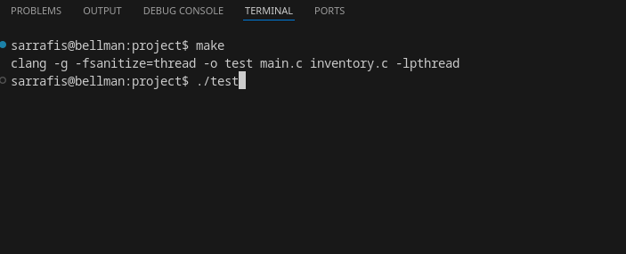
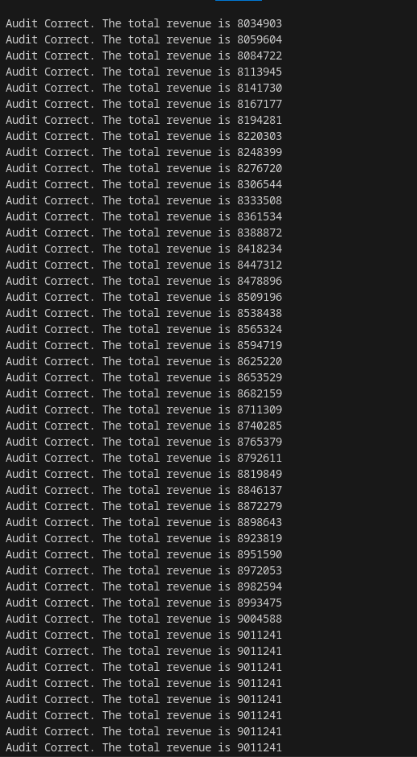
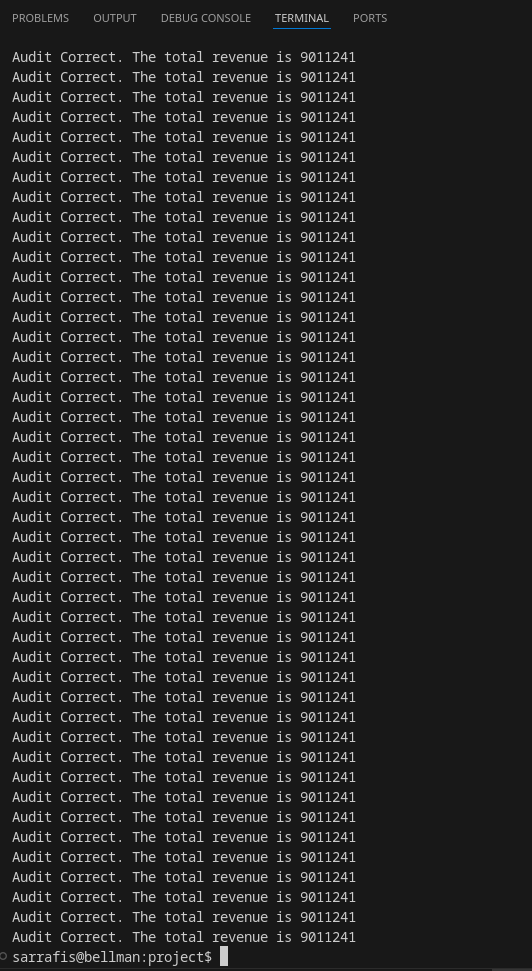
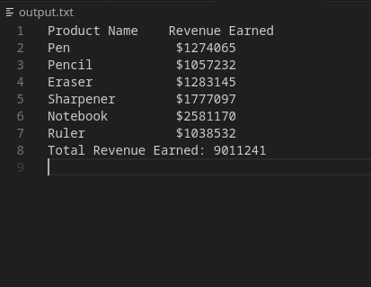

# Online Stationery Shopping Website: Backend Inventory

CSC-213 Fall 2024
Ishita Sarraf, Linda Jing, Han Cano

## Basic Use of the System 

This final project is a simple system that simulates an online stationery shopping website's backend inventory. We use `Parallelism with threads`, `Thread Synchronization`, and `Files and File Systems` as our 3 main concepts for this project. 

This system simulates 10,000 transactions with 5 user threads and 6 product threads in the inventory. It allows users to buy and return products. We also have a restock mechanism so that product quantities can keep updating. All products are initialized with a quantity of 100 and restock increments the count by 50. The user transactions for buying, returning, and determining the quantity they buy are all assigned randomly. We also assign a 10% probability that a user will return their bought product. These transactions are run by the 5 user threads in the `run-transactions` function. 

We also have an `audit` function that uses 1 thread to concurrently check the total revenue earned through the transacations by comparing the inventory revenue and the revenue earned through the user transactions. In the audit function, we also maintain an `output.txt` file that keeps track of the total revenue earned in the inventory. 

If the audit is incorrect at any point, the program stops running. Otherwise, it simply prints `Audit correct` along with the revenue calculated so far each time the audit runs. 

## Description of files in the directory

`inventory.c` : C file that creates the inventory

`main.c` : C file that creates the threads and runs the transactions for the program

`inventory.h` : Header file that contains C declaration and macro definitions that is shared between `inventory.c` and `main.c`

`output.txt` : The text file that is created at the end of the program that shows the total revenue

`Makefile` : Compiles all the code and checks for race conditions in threads using thread sanitizer 

`group.txt` : Text file that has author information and Academic Honesty statement for the class 

`.png files` : Screenshots of images included in this README file 

## General instructions

Download all the files. Then, to compile the code, use the Makefile and run `make` in the terminal. Make sure you run the command in the project directory. Then run `./test` in the terminal to run the program. 

## System Walk Through 

For a system walk through, since we don't have any user input and this is a simulated program, we will show screenshots of making and running the program, the expected output in the terminal, and the `output.txt` file. 

Here is how the code is compiled and run.

Below are the some screenshots of the expected output. There will be more printing statements that we are not including for the sake of conciseness. 

Here is the output file. 

